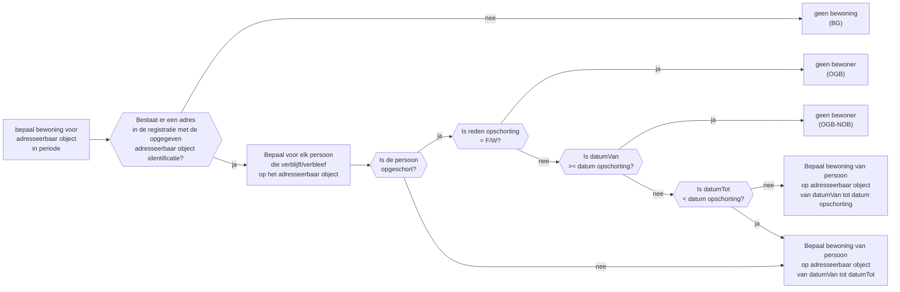
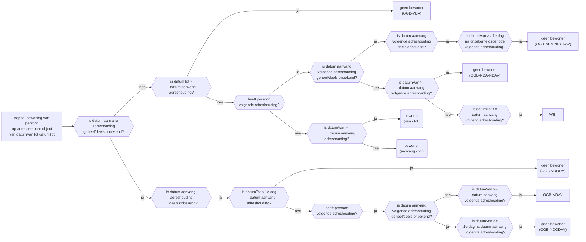

```mermaid
flowchart LR

A["bepaal bewoning voor
adresseerbaar object
in periode"]
A --> A0

A0{{"Bestaat er een adres
in de registratie met de opgegeven
adresseerbaar object identificatie?"}}
A0 -- nee -------> BG
A0 -- ja --> A1

A1["Bepaal voor elk persoon
die verblijft/verbleef
op het adresseerbaar object"]
A1 --> A2

A2{{"Is de persoon
opgeschort?"}}
A2 -- ja --> A3
A2 -- nee --> A7

A3{{"Is reden opschorting
= F/W?"}}
A3 -- ja ----> OGB
A3 -- nee --> A4

A4{{"Is datumVan
>= datum opschorting?"}}
A4 -- ja ---> OGB-NOB
A4 -- nee --> A5

A5{{"Is datumTot
< datum opschorting?"}}
A5 -- nee --> A6["Bepaal bewoning van persoon
op adresseerbaar object
van datumVan tot datum opschorting"]
A5 -- ja --> A7["Bepaal bewoning van persoon
op adresseerbaar object
van datumVan tot datumTot"]

BG["geen bewoning
(BG)"]
%% opgegeven adresseerbaar object bestaat niet in de registratie %%

OGB["geen bewoner
(OGB)"]
%% persoon heeft afgevoerde/logisch verwijderde persoonslijst %%

OGB-NOB["geen bewoner
(OGB-NOB)"]
%% persoon is opgeschort en gevraagde periode begint op/na datum opschorting %%

```

```mermaid
flowchart LR

B["Bepaal bewoning van persoon
op adresseerbaar object
van datumVan tot datumTot"]
B --> B0

B0{{"is datum aanvang adreshouding
geheel/deels onbekend?"}}
B0 -- nee --> B1
B0 -- ja --> C

    B1{{"is datumTot <
    datum aanvang adreshouding?"}}
    B1 -- ja ----> OGB-VDA
    B1 -- nee --> B2

        B2{{"heeft persoon
        volgende adreshouding?"}}
        B2 -- ja --> B3
        B2 -- nee --> D1

            B3{{"is datum aanvang
            volgende adreshouding
            geheel/deels onbekend?"}}
            B3 -- ja --> B5
            B3 -- nee --> B4

                B4{{"is datumVan >=
                datum aanvang
                volgende adreshouding?"}}
                B4 -- ja --> OGB-NDA-NDAV
                B4 -- nee --> D2

                B5{{"is datum aanvang
                volgende adreshouding
                deels onbekend?"}}
                B5 -- ja --> B6

                    B6{{"is datumVan >= 1e dag
                    na onzekerheidsperiode
                    volgende adreshouding?"}}
                    B6 -- ja --> OGB-NDA-NDODAV

            D1{{"is datumVan >=
            datum aanvang adreshouding?"}}
            D1 -- ja --> IB-NDA
            D1 -- nee --> IB-VDA

            D2{{"is datumTot >=
            datum aanvang
            volgend adreshouding?"}}
            D2 -- ja --> WB-
    C{{"is datum aanvang adreshouding
    deels onbekend?"}}
    C -- ja --> C1

        C1{{"is datumTot < 1e dag
        datum aanvang adreshouding?"}}
        C1 -- ja -----> OGB-VDODA
        C1 -- nee --> C2

            C2{{"heeft persoon
            volgende adreshouding?"}}
            C2 -- ja --> C3

                C3{{"is datum aanvang
                volgende adreshouding
                geheel/deels onbekend?"}}
                C3 -- nee --> C4
                C3 -- ja --> C5

                    C4{{"is datumVan >=
                    datum aanvang
                    volgende adreshouding?"}}
                    C4 -- ja --> OGB-NDAV

                    C5{{"is datumVan >=
                    1e dag na datum aanvang
                    volgende adreshouding?"}}
                    C5 -- ja --> OGB-NDODAV

OGB-VDA["geen bewoner
(OGB-VDA)"]
%% gevraagde periode eindigt op/vóór datum aanvang adreshouding %%

OGB-NDA-NDAV["geen bewoner
(OGB-NDA-NDAV)"]
%% gevraagde periode begint op/na datum aanvang volgende adreshouding %%

OGB-NDA-NDODAV["geen bewoner
(OGB-NDA-NDODAV)"]
%% gevraagde periode begint na onzekerheidsperiode volgende adreshouding %%

OGB-VDODA("geen bewoner
(OGB-VDODA)")
%% gevraagde periode eindigt op/vóór deels onbekend datum aanvang adreshouding %%

OGB-NDODAV("geen bewoner
(OGB-NDODAV)")
%% gevraagde periode begint op/na deels onbekend datum aanvang volgende adreshouding %%

IB-NDA("bewoner
(van - tot)")

IB-VDA("bewoner
(aanvang - tot)")
```
