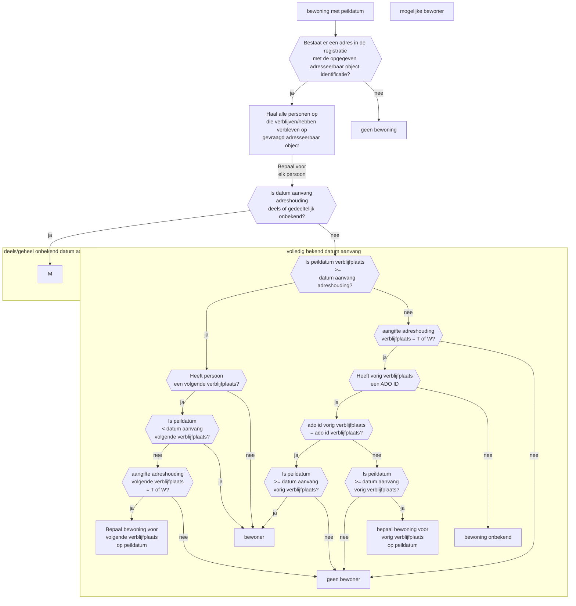

```mermaid
flowchart TB

A[bewoning met peildatum]
A0{{"Bestaat er een adres in de registratie
met de opgegeven adresseerbaar object identificatie?"}}
A1["Haal alle personen op
die verblijven/hebben verbleven op
gevraagd adresseerbaar object"]
A --> A0
A0 -- ja --> A1
A0 -- nee --> Z5
A1 -- "Bepaal voor
elk persoon" --> A2

A2{{"Is datum aanvang adreshouding
deels of gedeeltelijk onbekend?"}}
A2 -- ja --> M
A2 -- nee --> B

subgraph volledig bekend datum aanvang
    B{{"Is peildatum verblijfplaats
    >=
    datum aanvang adreshouding?"}}
    B --ja--> B1
    B --nee--> C

        B1{{"Heeft persoon
        een volgende verblijfplaats?"}}
        B1 -- ja --> B2
        B1 -- nee --> Z1

            B2{{"Is peildatum
            < datum aanvang
            volgende verblijfplaats?"}}
            B2 -- nee --> B3
            B2 -- ja --> Z1

            B3{{"aangifte adreshouding
            volgende verblijfplaats
            = T of W?"}}
            B3 -- ja --> B4["Bepaal bewoning voor
            volgende verblijfplaats
            op peildatum"]
            B3 -- nee ---> Z3

        C{{"aangifte adreshouding
        verblijfplaats = T of W?"}}
        C -- ja --> D
        C -- nee ---> Z3

        D{{"Heeft vorig verblijfplaats
        een ADO ID"}}
        D -- ja --> E
        D -- nee ----> Z4

            E{{"ado id vorig verblijfplaats
            = ado id verblijfplaats?"}}
            E -- ja --> F
            E -- nee --> G

            F{{"Is peildatum
            >= datum aanvang
            vorig verblijfplaats?"}}
            F -- ja --> Z1
            F -- nee ---> Z3

            G{{"Is peildatum
            >= datum aanvang
            vorig verblijfplaats?"}}
            G -- nee ---> Z3
            G -- ja --> H["bepaal bewoning voor
                        vorig verblijfplaats
                        op peildatum"]
end

subgraph deels/geheel onbekend datum aanvang
M
end

Z1[bewoner]
Z2[mogelijke bewoner]
Z3[geen bewoner]
Z4[bewoning onbekend]
Z5[geen bewoning]
```