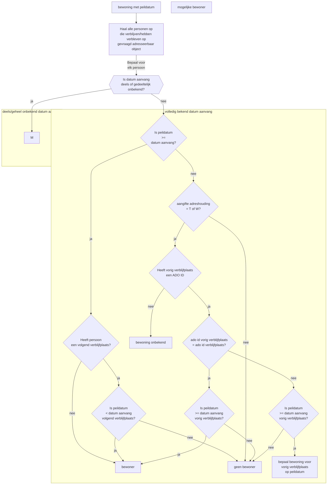

```mermaid
flowchart TB

A[bewoning met peildatum]
A1["Haal alle personen op
die verblijven/hebben verbleven op
gevraagd adresseerbaar object"]
A --> A1
A1 -- "Bepaal voor
elk persoon" --> A2

A2{{"Is datum aanvang
deels of gedeeltelijk onbekend?"}}

A2 -- ja --> M
A2 -- nee --> B

subgraph volledig bekend datum aanvang
    B{"Is peildatum
    >=
    datum aanvang?"}
    B --ja--> B1
    B --nee--> C

        B1{"Heeft persoon
        een volgend verblijfplaats?"}
        B1 -- nee --> Z1
        B1 -- ja --> B2

            B2{"Is peildatum
            < datum aanvang
            volgend verblijfplaats?"}
            B2 -- ja --> Z1
            B2 -- nee --> Z3

        C{"aangifte adreshouding
        = T of W?"}
        C -- nee --> Z3
        C -- ja --> D

        D{"Heeft vorig verblijfplaats
        een ADO ID"}
        D -- nee --> Z4
        D -- ja --> E

            E{"ado id vorig verblijfplaats
            = ado id verblijfplaats?"}
            E -- ja --> F
            E -- nee --> G

            F{"Is peildatum
            >= datum aanvang
            vorig verblijfplaats?"}
            F -- ja --> Z1
            F -- nee --> Z3

            G{"Is peildatum
            >= datum aanvang
            vorig verblijfplaats?"}
            G -- ja --> H["bepaal bewoning voor
                        vorig verblijfplaats
                        op peildatum"]
            G -- nee --> Z3
end

subgraph deels/geheel onbekend datum aanvang
M
end

Z1[bewoner]
Z2[mogelijke bewoner]
Z3[geen bewoner]
Z4[bewoning onbekend]
```