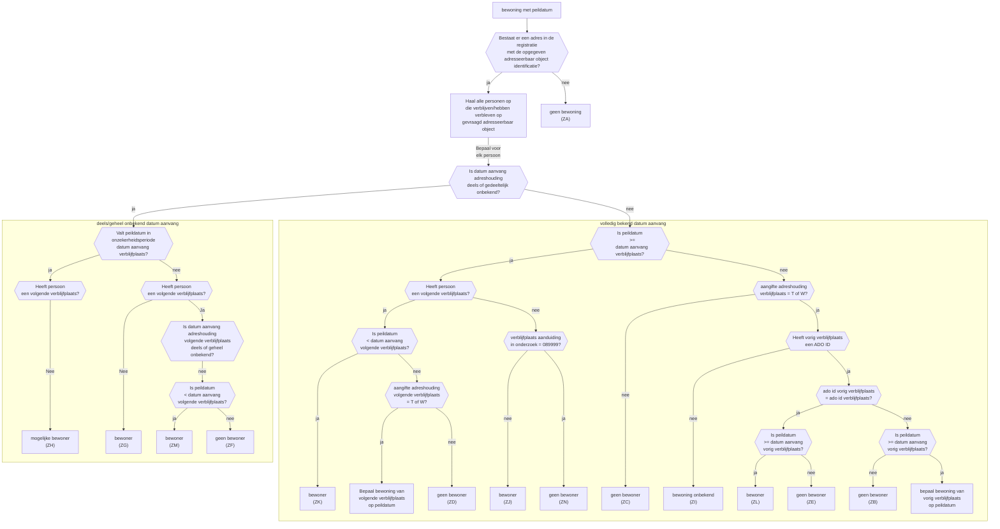

```mermaid
flowchart TB

A[bewoning met peildatum]
A --> A0

A0{{"Bestaat er een adres in de registratie
met de opgegeven adresseerbaar object identificatie?"}}
A0 -- ja --> A1
A0 -- nee --> ZA

A1["Haal alle personen op
die verblijven/hebben verbleven op
gevraagd adresseerbaar object"]
A1 -- "Bepaal voor
elk persoon" --> A2

A2{{"Is datum aanvang adreshouding
deels of gedeeltelijk onbekend?"}}
A2 -- ja --> M
A2 -- nee --> B

subgraph volledig bekend datum aanvang
    B{{"Is peildatum
    >=
    datum aanvang verblijfplaats?"}}
    B --ja--> B1
    B --nee--> C

        B1{{"Heeft persoon
        een volgende verblijfplaats?"}}
        B1 -- ja --> B2
        B1 -- nee --> B5

            B2{{"Is peildatum
            < datum aanvang
            volgende verblijfplaats?"}}
            B2 -- nee --> B3
            B2 -- ja ----> ZK

            B3{{"aangifte adreshouding
            volgende verblijfplaats
            = T of W?"}}
            B3 -- ja ---> B4["Bepaal bewoning van
            volgende verblijfplaats
            op peildatum"]
            B3 -- nee ---> ZD

            B5{{"verblijfplaats aanduiding
            in onderzoek = 089999?"}}
            B5 -- nee ----> ZJ
            B5 -- ja ----> ZN

        C{{"aangifte adreshouding
        verblijfplaats = T of W?"}}
        C -- ja --> D
        C -- nee -----> ZC

        D{{"Heeft vorig verblijfplaats
        een ADO ID"}}
        D -- ja --> E
        D -- nee ----> ZI

            E{{"ado id vorig verblijfplaats
            = ado id verblijfplaats?"}}
            E -- ja --> F
            E -- nee --> G

            F{{"Is peildatum
            >= datum aanvang
            vorig verblijfplaats?"}}
            F -- ja --> ZL
            F -- nee --> ZE

            G{{"Is peildatum
            >= datum aanvang
            vorig verblijfplaats?"}}
            G -- nee --> ZB
            G -- ja --> H["bepaal bewoning van
                        vorig verblijfplaats
                        op peildatum"]
end

subgraph deels/geheel onbekend datum aanvang

M{{"Valt peildatum in
onzekerheidsperiode
datum aanvang verblijfplaats?"}}
M -- ja --> N
M -- nee --> O

    N{{"Heeft persoon
    een volgende verblijfplaats?"}}
    N -- Nee ----> ZH

    O{{"Heeft persoon
    een volgende verblijfplaats?"}}
    O -- Ja --> O1
    O -- Nee ----> ZG

        O1{{"Is datum aanvang adreshouding
        volgende verblijfplaats
        deels of geheel onbekend?"}}
        O1 -- nee --> O2

            O2{{"Is peildatum
            < datum aanvang
            volgende verblijfplaats?"}}
            O2 -- ja --> ZM
            O2 -- nee --> ZF
end

ZA["geen bewoning
(ZA)"]
click ZA "https://brp-api.github.io/Haal-Centraal-BRP-bewoning/" "opgegeven adresseerbaar object bestaat niet" _blank

ZB["geen bewoner
(ZB)"]
click ZB "https://brp-api.github.io/Haal-Centraal-BRP-bewoning/" "bewoner verblijft/verbleef op opgegeven adresseerbaar object (gesplitst/samengevoegd) en peildatum valt vóór datum aanvang oorspronkelijk verblijf" _blank

ZC["geen bewoner
(ZC)"]
click ZC "https://brp-api.github.io/Haal-Centraal-BRP-bewoning/" "bewoner verblijft/verbleef op opgegeven adresseerbaar object en peildatum valt in vorig verblijfsperiode" _blank

ZD["geen bewoner
(ZD)"]
click ZD "https://brp-api.github.io/Haal-Centraal-BRP-bewoning/" "bewoner verbleef op opgegeven adresseerbaar object en peildatum valt in volgende verblijfsperiode" _blank

ZE["geen bewoner
(ZE)"]
click ZE "https://brp-api.github.io/Haal-Centraal-BRP-bewoning/" "bewoner verbleef op opgegeven adresseerbaar object (gewijzigd) en peildatum valt in vorig verblijf" _blank

ZF["geen bewoner
(ZF)"]
click ZF "https://brp-api.github.io/Haal-Centraal-BRP-bewoning/" "bewoner verbleef op opgegeven adresseerbaar object met geheel/gedeeltelijk onbekend datum aanvang en peildatum valt in volgende verblijfsperiode" _blank

ZG["bewoner
(ZG)"]
click ZG "https://brp-api.github.io/Haal-Centraal-BRP-bewoning/" "bewoner verblijft op opgegeven adresseerbaar object met geheel/gedeeltelijk onbekend datum aanvang en peildatum valt niet in onzekerheidsperiode" _blank

ZH["mogelijke bewoner
(ZH)"]
click ZH "https://brp-api.github.io/Haal-Centraal-BRP-bewoning/" "bewoner verblijft op opgegeven adresseerbaar object met geheel/gedeeltelijk onbekend datum aanvang en peildatum valt in onzekerheidsperiode" _blank

ZI["bewoning onbekend
(ZI)"]
click ZI "https://brp-api.github.io/Haal-Centraal-BRP-bewoning/" "bewoner verblijft op peildatum op een niet-BAG adres" _blank

ZJ["bewoner
(ZJ)"]
click ZJ "https://brp-api.github.io/Haal-Centraal-BRP-bewoning/" "bewoner verblijft op opgegeven adresseerbaar object" _blank

ZK["bewoner
(ZK)"]
click ZK "https://brp-api.github.io/Haal-Centraal-BRP-bewoning/" "bewoner verbleef op peildatum op opgegeven adresseerbaar object" _blank

ZL["bewoner
(ZL)"]
click ZL "https://brp-api.github.io/Haal-Centraal-BRP-bewoning/" "bewoner van gewijzigd verblijfplaats" _blank

ZM["bewoner
(ZM)"]
click ZM "https://brp-api.github.io/Haal-Centraal-BRP-bewoning/" "bewoner verbleef op peildatum op opgegeven adresseerbaar object met geheel/gedeeltelijk onbekend datum aanvang" _blank

ZN["geen bewoner
(ZN)"]
click ZN "https://brp-api.github.io/Haal-Centraal-BRP-bewoning/" "vastgesteld persoon is geen bewoner" _blank
```