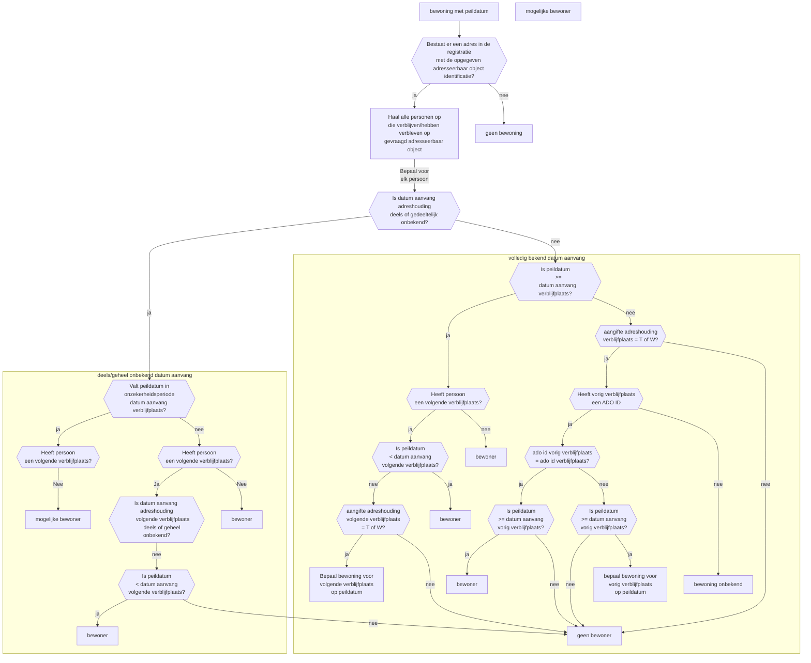

```mermaid
flowchart TB

A[bewoning met peildatum]
A --> A0

A0{{"Bestaat er een adres in de registratie
met de opgegeven adresseerbaar object identificatie?"}}
A0 -- ja --> A1
A0 -- nee --> ZOAO

A1["Haal alle personen op
die verblijven/hebben verbleven op
gevraagd adresseerbaar object"]
A1 -- "Bepaal voor
elk persoon" --> A2

A2{{"Is datum aanvang adreshouding
deels of gedeeltelijk onbekend?"}}
A2 -- ja --> M
A2 -- nee --> B

subgraph volledig bekend datum aanvang
    B{{"Is peildatum
    >=
    datum aanvang verblijfplaats?"}}
    B --ja--> B1
    B --nee--> C

        B1{{"Heeft persoon
        een volgende verblijfplaats?"}}
        B1 -- ja --> B2
        B1 -- nee --> ZBZVV

            B2{{"Is peildatum
            < datum aanvang
            volgende verblijfplaats?"}}
            B2 -- nee --> B3
            B2 -- ja --> ZBMVV

            B3{{"aangifte adreshouding
            volgende verblijfplaats
            = T of W?"}}
            B3 -- ja --> B4["Bepaal bewoning voor
            volgende verblijfplaats
            op peildatum"]
            B3 -- nee ---> Z3

        C{{"aangifte adreshouding
        verblijfplaats = T of W?"}}
        C -- ja --> D
        C -- nee ---> Z3

        D{{"Heeft vorig verblijfplaats
        een ADO ID"}}
        D -- ja --> E
        D -- nee ----> ZNBAG

            E{{"ado id vorig verblijfplaats
            = ado id verblijfplaats?"}}
            E -- ja --> F
            E -- nee --> G

            F{{"Is peildatum
            >= datum aanvang
            vorig verblijfplaats?"}}
            F -- ja --> ZBGV
            F -- nee ---> Z3

            G{{"Is peildatum
            >= datum aanvang
            vorig verblijfplaats?"}}
            G -- nee ---> Z3
            G -- ja --> H["bepaal bewoning voor
                        vorig verblijfplaats
                        op peildatum"]
end

subgraph deels/geheel onbekend datum aanvang

M{{"Valt peildatum in
onzekerheidsperiode
datum aanvang verblijfplaats?"}}
M -- ja --> N
M -- nee --> O

    N{{"Heeft persoon
    een volgende verblijfplaats?"}}
    N -- Nee --> ZMBZVV

    O{{"Heeft persoon
    een volgende verblijfplaats?"}}
    O -- Ja --> O1
    O -- Nee --> ZOBZVV

        O1{{"Is datum aanvang adreshouding
        volgende verblijfplaats
        deels of geheel onbekend?"}}
        O1 -- nee --> O2

            O2{{"Is peildatum
            < datum aanvang
            volgende verblijfplaats?"}}
            O2 -- ja --> Z1
            O2 -- nee --> Z3
end

Z1[bewoner]
Z2[mogelijke bewoner]
Z3[geen bewoner]
ZOBZVV[bewoner]
click ZOBZVV "https://brp-api.github.io/Haal-Centraal-BRP-bewoning/" "bewoner met geheel/gedeeltelijk onbekend datum aanvang, verblijft op opgegeven adresseerbaar object en peildatum valt niet in onzekerheidsperiode" _blank
ZMBZVV[mogelijke bewoner]
click ZMBZVV "https://brp-api.github.io/Haal-Centraal-BRP-bewoning/" "bewoner met geheel/gedeeltelijk onbekend datum aanvang, verblijft op opgegeven adresseerbaar object en peildatum valt in onzekerheidsperiode" _blank
ZNBAG[bewoning onbekend]
click ZNBAG "https://brp-api.github.io/Haal-Centraal-BRP-bewoning/" "bewoner verblijft op peildatum op een niet-BAG adres" _blank
ZOAO[geen bewoning]
click ZOAO "https://brp-api.github.io/Haal-Centraal-BRP-bewoning/" "opgegeven adresseerbaar object bestaat niet" _blank
ZBZVV[bewoner]
click ZBZVV "https://brp-api.github.io/Haal-Centraal-BRP-bewoning/" "bewoner verblijft op opgegeven adresseerbaar object" _blank
ZBMVV[bewoner]
click ZBMVV "https://brp-api.github.io/Haal-Centraal-BRP-bewoning/" "bewoner verbleef op peildatum op opgegeven adresseerbaar object" _blank
ZBGV[bewoner]
click ZBGV "https://brp-api.github.io/Haal-Centraal-BRP-bewoning/" "bewoner van gewijzigd verblijfplaats" _blank
```