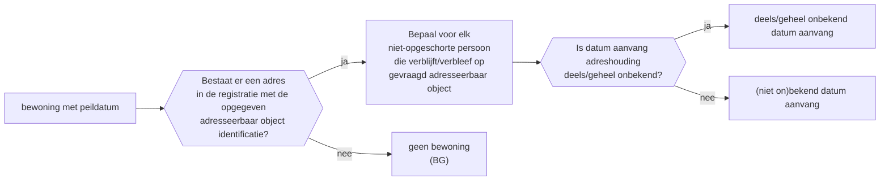

```mermaid
flowchart TB

B{{"Is peildatum
>=
datum aanvang verblijf?"}}
B --ja--> B1
B --nee--> C

    B1{{"Heeft persoon
    volgende verblijf?"}}
    B1 -- ja --> B2
    B1 -- nee --> B6

        B2{{"Is datum aanvang
        volgende verblijf
        geheel/deels onbekend?"}}
        B2 -- nee --> B3
        B2 -- ja --> I

            B3{{"Is peildatum
            < datum aanvang
            volgende verblijf?"}}
            B3 -- nee --> B4
            B3 -- ja ---> WB-NNO-VNOV

                B4{{"aangifte adreshouding
                volgende verblijf
                = T of W?"}}
                B4 -- ja --> B5["Bepaal bewoning van
                volgende verblijfplaats
                op peildatum"]
                B4 -- nee --> GB-NNO-NNOV

        B6{{"aanduiding in onderzoek
        verblijf = 089999?"}}
        B6 -- nee ----> IB-NNO-GV
        B6 -- ja ----> VGB-NNO-GV

        I{{"Is datum aanvang
        volgende verblijf
        geheel onbekend?"}}
        I -- ja --> I1
        I -- nee --> J

            I1{{"peildatum =
            datum aanvang verblijf?"}}
            I1 -- ja --> WB-INO-IGOV
            I1 -- nee --> MB-NNO-IGOV

    C{{"aangifte adreshouding
    verblijf = T of W?"}}
    C -- ja --> D
    C -- nee -----> GB-VNO

    D{{"Heeft adres vorig verblijf
    een ADO ID"}}
    D -- ja --> E
    D -- nee ----> BO-VNOT

        E{{"ado id vorig verblijf
        = ado id verblijf?"}}
        E -- ja --> F
        E -- nee --> G

        F{{"Is peildatum
        >= datum aanvang
        vorig verblijf?"}}
        F -- ja --> IB-NNOT
        F -- nee --> GB-VNOT

        G{{"Is peildatum
        >= datum aanvang
        vorig verblijf?"}}
        G -- nee --> GB-VNOW
        G -- ja --> H["bepaal bewoning van
                    vorig verblijfplaats
                    op peildatum"]

GB-NNO-NNOV["geen bewoner
(GB-NNO-NNOV)"]
%% persoon met bekend datum aanvang verblijf, bekend datum aanvang volgend verblijf en peildatum valt op/na datum aanvang volgend verblijf %%

WB-NNO-VNOV["bewoner
(WB-NNO-VNOV)"]
%% persoon met bekend datum aanvang verblijf, bekend datum aanvang volgend verblijf en peildatum valt vóór datum aanvang volgend verblijf %%

IB-NNO-GV["bewoner
(IB-NNO-GV)"]
%% persoon met bekend datum aanvang verblijf, geen volgend verblijf en peildatum valt op/na datum aanvang verblijf %%

VGB-NNO-GV["vastgesteld
geen bewoner
(VGB-NNO-GV)"]
%% persoon met bekend datum aanvang verblijf, geen volgend verblijf, peildatum valt op/na datum aanvang verblijf en aanduiding in onderzoek = 089999 %%

BO-VNOT["bewoning onbekend
(BO-VNOT)"]
%% persoon met bekend datum aanvang verblijf en aangifte adreshouding = T, vorig verblijf is geen BAG adres en peildatum valt vóór datum aanvang verblijf %%

GB-VNO["geen bewoner
(GB-VNO)"]
%% persoon met bekend datum aanvang verblijf, geen volgend verblijf en peildatum valt vÓÓr datum aanvang verblijf %%

IB-NNOT["bewoner
(IB-NNOT)"]
%% persoon met bekend datum aanvang verblijf en aangifte adreshouding = T en peildatum valt op/na datum aanvang (vorig) verblijf %%

GB-VNOT["geen bewoner
(GB-VNOT)"]
%% persoon met bekend datum aanvang verblijf en aangifte adreshouding = T en peildatum valt vóór datum aanvang (vorig) verblijf %%

GB-VNOW["geen bewoner
(GB-VNOW)"]
%% persoon met bekend datum aanvang verblijf en aangifte adreshouding = W en peildatum valt vóór datum aanvang vorig verblijf %%

WB-INO-IGOV["bewoner
(WB-INO-IGOV)"]
%% persoon met bekend datum aanvang verblijf en geheel onbekend datum aanvang volgend verblijf en peildatum valt op datum aanvang verblijf %%

MB-NNO-IGOV["mogelijke bewoner
(MB-NNO-IGOV)"]
%% persoon met bekend datum aanvang verblijf en geheel onbekend datum aanvang volgend verblijf en peildatum valt na datum aanvang verblijf %%

```

Legenda:

IB = is bewoner  
WB = was bewoner 
MB = mogelijke bewoner 
GB = geen bewoner  
VGB = vastgesteld geen bewoner  
BO = bewoning onbekend  
BG = geen bewoning

NO = (niet on)bekend datum aanvang  
NOT = (niet on)bekend datum aanvang en aangifte adreshouding = technisch gewijzigd  
NOW = (niet on)bekend datum aanvang en aangifte adreshouding = infrastructureel gewijzigd  

VNO = vóór (niet on)bekend datum aanvang
NNO = op of na (niet on)bekend datum aanvang
INO = op (niet on)bekend datum aanvang

GV = geen volgend datum aanvang  
NOV = (niet on)bekend volgend datum aanvang  
NOVT = (niet on)bekend volgend datum aanvang en aangifte adreshouding = technisch gewijzigd  
NOVW = (niet on)bekend volgend datum aanvang en aangifte adreshouding = infrastructureel gewijzigd  

VNOV = vóór (niet on)bekend volgend datum aanvang  
NNOV = op/na (niet on)bekend volgend datum aanvang
