```mermaid
flowchart

M0["persoon heeft deels/geheel
onbekend datum aanvang"]
M0 --> M

M{{"Is datum aanvang 
opgegeven verblijf
geheel onbekend?"}}
M -- ja --> N
M -- nee --> O

    N{{"Heeft persoon
    volgende verblijf?"}}
    N -- nee --------> MB-GO-VG
    N -- ja --> N1

        N1{{"Is datum aanvang
        volgende verblijf
        geheel/deels onbekend?"}}
        N1 -- nee --> N2
        N1 -- ja --> N3

            N2{{"Is peildatum
            < datum aanvang 
            volgende verblijf?"}}
            N2 -- ja ------> MB-GO-VNOV
            N2 -- nee ------> GB-GO-NNOV

            N3{{"Is datum aanvang
            volgende verblijf
            geheel onbekend?"}}
            N3 -- ja ------> MB-GO-GOV
            N3 -- nee --> N4

                N4{{"Valt peildatum
                in onzekerheidsperiode
                datum aanvang volgende verblijf?"}}
                N4 -- ja -----> MB-GO-IDOV
                N4 -- nee --> N5

                    N5{{"Is peildatum
                    > onzekerheidsperiode
                    datum aanvang volgende verblijf?"}}
                    N5 -- ja ----> GB-GO-NDOV
                    N5 -- nee ----> MB-GO-VDOV 

    O{{"Valt peildatum
    in onzekerheidsperiode
    datum aanvang verblijf?"}}
    O -- ja --------> MB-IDO
    O -- nee --> O1

        O1{{"Is peildatum
        > onzekerheidsperiode
        datum aanvang verblijf?"}}
        O1 -- nee -------> GB-VDO
        O1 -- ja --> O2

            O2{{"Heeft persoon
            volgende verblijf?"}}
            O2 -- nee ------> IB-NDO-GV
            O2 -- ja --> O3

                O3{{"Is datum aanvang
                volgende verblijf
                geheel/gedeeltelijk onbekend?"}}
                O3 -- nee --> O4
                O3 -- ja --> O5

                O4{{"Is peildatum
                < datum aanvang
                volgende verblijf?"}}
                O4 -- ja ----> WB-DO-VNOV
                O4 -- nee ----> GB-DO-NNOV

                O5{{"Is datum aanvang
                volgende verblijf
                geheel onbekend?"}}
                O5 -- ja ----> MB-DO-GOV
                O5 -- nee --> O6

                    O6{{"Valt peildatum
                    in onzekerheidsperiode
                    datum aanvang volgende verblijf?"}}
                    O6 -- ja ---> MB-DO-IDOV
                    O6 -- nee --> O7

                        O7{{"Is peildatum
                        > onzekerheidsperiode
                        datum aanvang volgende verblijf?"}}
                        O7 -- ja --> GB-DO-NDOV
                        O7 -- nee --> WB-DO-VDOV


MB-GO-VG["mogelijke bewoner
(MB-GO-VG)"]
%% persoon met geheel onbekend datum aanvang verblijf en geen volgend verblijf %%

MB-GO-VNOV["mogelijke bewoner
(MB-GO-VNOV)"]
%% persoon met geheel onbekend datum aanvang verblijf en peildatum < onzekerheidsperiode datum aanvang volgend verblijf %%

GB-GO-NNOV["geen bewoner
(GB-GO-NNOV)"]
%% persoon met geheel onbekend datum aanvang verblijf en peildatum >= datum aanvang volgend verblijf %%

MB-GO-GOV["mogelijke bewoner
(MB-GO-GOV)"]
%% persoon met geheel onbekend datum aanvang verblijf en geheel onbekend datum aanvang volgend verblijf %%

MB-GO-IDOV["mogelijke bewoner
(MB-GO-IDOV)"]
%% persoon met geheel onbekend datum aanvang verblijf en deels onbekend datum aanvang volgend verblijf en peildatum valt in onzekerheidsperiode datum aanvang volgend verblijf %% 

GB-GO-NDOV["geen bewoner
(GB-GO-NDOV)"]
%% persoon met geheel onbekend datum aanvang verblijf en deels onbekend volgend datum aanvang  volgend verblijf en peildatum ligt na onzekerheidsperiode datum aanvang volgend verblijf %%

MB-GO-VDOV["mogelijke bewoner
(MB-GO-VDOV)"]
%% persoon met geheel onbekend datum aanvang verblijf en deels onbekend datum aanvang volgend verblijf en peildatum ligt vóór datum aanvang volgend verblijf %%

MB-IDO["mogelijke bewoner
(MB-IDO)"]
%% persoon met deels onbekend datum aanvang verblijf en peildatum valt in onzekerheidsperiode van verblijf

GB-VDO["geen bewoner
(GB-VDO)"]
%% persoon met deels onbekend datum aanvang verblijf en peildatum ligt vóór onzekerheidsperiode datum aanvang verblijf %%

IB-NDO-GV["bewoner
(IB-NDO-GV)"]
%% persoon met deels onbekend datum aanvang verblijf, geen volgend verblijf en peildatum ligt na onzekerheidsperiode datum aanvang verblijf %%

WB-DO-VNOV["bewoner
(WB-DO-VNOV)"]
%% persoon met deels onbekend datum aanvang verblijf, bekend datum aanvang volgend verblijf en peildatum ligt vóór datum aanvang volgend verblijf %%

GB-DO-NNOV["geen bewoner
(GB-DO-NNOV)"]
%% persoon met deels onbekend datum aanvang verblijf, bekend datum aanvang volgend verblijf en peildatum ligt op/na datum aanvang volgend verblijf

MB-DO-GOV["mogelijke bewoner
(MB-DO-GOV)"]
%% persoon met deels onbekend datum aanvang verblijf, geheel onbekend datum aanvang volgend verblijf %%

MB-DO-IDOV["mogelijke bewoner
(MB-DO-IDOV)"]
%% persoon met deels onbekend datum aanvang verblijf, deels onbekend datum aanvang volgend verblijf en peildatum valt in onzekerheidsperiode datum aanvang volgend verblijf %%

GB-DO-NDOV["geen bewoner
(GB-DO-NDOV)"]
%% persoon met deels onbekend datum aanvang verblijf, deels onbekend datum aanvang volgend verblijf en peildatum valt na onzekerheidsperiode datum aanvang volgend verblijf %%

WB-DO-VDOV["bewoner
(WB-DO-VDOV)"]
%% persoon met deels onbekend datum aanvang verblijf, deels onbekend datum aanvang volgend verblijf en peildatum valt vóór onzekerheidsperiode datum aanvang volgend verblijf %%

```

IB = is bewoner  
WB = was bewoner  
MB = mogelijke bewoner  
GB = geen bewoner

GO = geheel onbekend datum aanvang  
DO = deels onbekend datum aanvang  
NO = (niet on)bekend datum aanvang

GV = geen volgend datum aanvang  
GOV = geheel onbekend volgend datum aanvang  
DOV = deels onbekend volgend datum aanvang  
NOV = (niet on)bekend volgend datum aanvang

IGO = in onzekerheidsperiode geheel onbekend datum aanvang  
IDOV = in onzekerheidsperiode deels onbekend volgend datum aanvang  
VDO = vóór onzekerheidsperiode deels onbekend datum aanvang  
NNOV = na (niet on)bekend volgend datum aanvang
