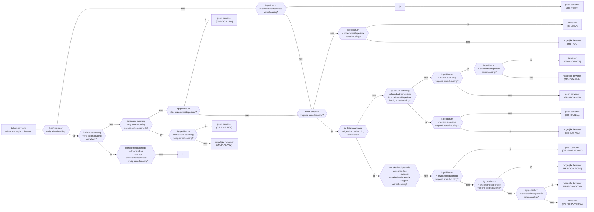

```mermaid
flowchart LR

A["datum aanvang
adreshouding is onbekend"]
A --> A1

A1{{"heeft persoon
vorig adreshouding?"}}
A1 -- nee --> A2
A1 -- ja --> B

    A2{{"is peildatum
    < onzekerheidsperiode
    adreshouding?"}}
    A2 ----- ja -----> GB-VDOA["geen bewoner
    (GB-VDOA)"]
    A2 -- nee --> A3

        A3{{"heeft persoon
        volgend adreshouding?"}}
        A3 -- nee --> A4
        A3 -- ja --> A5

            A4{{"is peildatum
            > onzekerheidsperiode
            adreshouding?"}}
            A4 -- ja ------> IB-NDOA["bewoner
            (IB-NDOA)"]
            A4 -- nee ------> MB-IOA["mogelijke bewoner
            (MB_IOA)"]

            A5{{"is datum aanvang
            volgend adreshouding
            onbekend?"}}
            A5 -- nee --> A6
            A5 -- ja --> A10

                A6{{"ligt datum aanvang
                volgend adreshouding
                in onzekerheidsperiode
                huidig adreshouding?"}}
                A6 -- nee --> A7
                A6 -- ja --> A9

                    A7{{"is peildatum
                    < datum aanvang
                    volgend adreshouding?"}}
                    A7 -- ja --> A8
                    A7 -- nee ----> GB-NDOA-NVA["geen bewoner
                    (GB-NDOA-NVA)"]

                        A8{{"is peildatum
                        > onzekerheidsperiode
                        adreshouding?"}}
                        A8 -- ja ---> WB-NDOA-VVA["bewoner
                        (WB-NDOA-VVA)"]
                        A8 -- nee ---> MB-IDOA-VVA["mogelijke bewoner
                        (MB-IDOA-VVA)"]

                    A9{{"is peildatum
                    < datum aanvang
                    volgend adreshouding?"}}
                    A9 -- nee ----> GB-IOA-NVA["geen bewoner
                    (GB-IOA-NVA)"]
                    A9 -- ja ----> MB-IOA-VVA["mogelijke bewoner
                    (MB-IOA-VVA)"]

                A10{{"onzekerheidsperiode adreshouding
                overlapt onzekerheidsperiode
                volgend adreshouding?"}}
                A10 -- nee --> A11

                    A11{{"is peildatum
                    > onzekerheidsperiode
                    volgend adreshouding?"}}
                    A11 -- ja ----> GB-NDOA-NDOVA["geen bewoner
                    (GB-NDOA-NDOVA)"]
                    A11 -- nee --> A12

                    A12{{"ligt peildatum
                    in onzekerheidsperiode
                    volgend adreshouding?"}}
                    A12 -- ja ---> MB-NDOA-IDOVA["mogelijke bewoner
                    (MB-NDOA-IDOVA)"]
                    A12 -- nee --> A13

                    A13{{"ligt peildatum
                    in onzekerheidsperiode
                    adreshouding?"}}
                    A13 -- ja --> MB-IDOA-VDOVA["mogelijke bewoner
                    (MB-IDOA-VDOVA)"]
                    A13 -- nee --> WB-NDOA-VDOVA["bewoner
                    (WB-NDOA-VDOVA)"]

    B{{"is datum aanvang
    vorig adreshouding
    onbekend?"}}
    B -- nee --> B1
    B -- ja --> C

        B1{{"ligt datum aanvang
        vorig adreshouding
        in onzekerheidsperiode?"}}
        B1 -- nee --> B2
        B1 -- ja --> B3

            B2{{"ligt peildatum
            vóór onzekerheidsperiode?"}}
            B2 -- ja --> GB-VDOA-NPA["geen bewoner
            (GB-VDOA-NPA)"]
            B2 -- nee -----> A3

            B3{{"ligt peildatum
            vóór datum aanvang
            vorig adreshouding?"}}
            B3 -- ja --> GB-IDOA-NPA["geen bewoner
            (GB-IDOA-NPA)"]
            B3 -- nee --> MB-IDOA-VPA["mogelijke bewoner
            (MB-IDOA-VPA)"]

        C{{"onzekerheidsperiode adreshouding
        overlapt onzekerheidsperiode
        vorig adreshouding?"}}
        C -- nee --> C1
```
