# {{ site.apiname }} Web API Features

Met de {{ site.apiname }} Web API kun je de bewoning van een adresseerbaar object in een periode raadplegen. Bewoning kun je ophalen met de identificatie van een adresseerbaar object.

## Algemene Verordening Gegevensbescherming (AVG)

De '{{ site.apiname }}' Web API is ontworpen conform de REST principes. Om aan de AVG te conformeren zijn er concessies gedaan aan het toepassen van de REST principes. De belangrijkste concessie is dat de POST methode en niet de GET methode wordt gebruikt om bewoning te raadplegen. Dit zorgt er voor dat er geen [persoonlijk identificeerbare informatie (PII)](https://piwikpro.nl/blog/pii-niet-pii-en-persoonsgegevens/) terecht komt in de url van een request en daarmee ook niet in server logs. We anticiperen daarmee op het raadplegen van bewoningen van een persoon, die je in een volgende versie van de Bewoning API kunt ophalen met een BSN.

## Raadplegen van de bewoning van een adresseerbaar object

Met behulp van de 'raadpleeg bewoning met periode' operatie wordt voor een adresseerbaar object de bewoning in een periode opgehaald.

Een bewoning geeft de samenstelling van de bewoners in een periode op een adresseerbaar object weer. De response van een bevraging bevat meerdere bewoningen als de samenstelling van de bewoners in de gevraagde periode is wijzigd.

Een persoon is en was bewoner van een adresseerbaar object als hij volgens de BRP registratie is/was ingeschreven op het adresseerbaar object in de gevraagde periode. De bewoning/adreshouding periode begint op de **datum aanvang adreshouding** van de inschrijving op het adresseerbaar object en eindigt (indien aanwezig) op de **datum aanvang adreshouding** van de volgende inschrijving of op de **datum aanvang adres buitenland** als de persoon is geëmigreerd.

Een persoon is in een gevraagde periode bewoner als de gevraagde periode in de adreshouding periode van de persoon ligt. Overlapt de gevraagde periode geheel of deels de adreshouding van de persoon, dan wordt de persoon alleen voor het overlappende gedeelte van de gevraagde periode als bewoner meegenomen.

Onderstaand stroomdiagram illustreert de beslisboom voor het bepalen of een persoon is ingeschreven op het adresseerbaar object in de gevraagde periode, of voor een deel van de gevraagde periode wordt meegenomen als bewoner. De datum aanvang (volgende) adreshouding is in deze beslisboom niet geheel of gedeeltelijk onbekend.

