# {{ site.apiname }} Web API Features

De {{ site.apiname }} Web API maakt het mogelijk om de bewoners van een adresseerbaar object in de basisregistratie personen (BRP) te raadplegen. De bewoners van een adresseerbaar object worden opgezocht met behulp van de identificatiecode van het adresseerbaar object.

## Algemene Verordening Gegevensbescherming (AVG)

De '{{ site.apiname }}' Web API is ontworpen conform de REST principes. Om ook aan de AVG te conformeren zijn er concessies gedaan met betrekking tot het toepassen van de REST principes. De belangrijkste concessie is dat de POST methode en niet de GET methode wordt gebruikt om bewoners te bevragen. Dit zorgt er voor dat er geen [persoonlijk identificeerbare informatie (PII)](https://piwikpro.nl/blog/pii-niet-pii-en-persoonsgegevens/) terecht komen in de url van een request en daardoor ook niet in server logs.

## Raadplegen van bewoners van een adresseerbaar object

De bewoners van een adresseerbaar object kunnen worden opgezocht met behulp van de identificatiecode van het adresseerbaar object. Hiervoor kunnen de volgende operaties worden gebruikt:

- raadpleeg bewoning op peildatum
- raadpleeg bewoning in periode (TODO)

Het resultaat van deze operaties is een Bewoning collectie/lijst.

De raadpleeg bewoning op peildatum operatie bepaalt welke personen op een datum (mogelijk) verblijven/hebben verbleven op het adresseerbaar object.

Onderstaand schema geeft visueel weer hoe de bewoning van een adresseerbaar object op een peildatum wordt bepaald.

### Geen bewoning

[Bewoning wordt alleen geleverd voor adresseerbare objecten die zijn geregistreerd in de BRP](../features/raadpleeg-bewoning-op-peildatum/overzicht.feature#bewoning-wordt-alleen-geleverd-voor-adresseerbare-objecten-die-zijn-geregistreerd-in-de-BRP)

### Bewoner

[Een persoon is bewoner van een adresseerbaar object als de peildatum valt](../features/raadpleeg-bewoning-op-peildatum/overzicht.feature#een-persoon-is-bewoner-van-een-adresseerbaar-object-als-de-peildatum-valt)
- op of na datum aanvang adreshouding op het adresseerbaar object en
- er is geen volgende verblijfplaats

[Een persoon was bewoner van een adresseerbaar object als de peildatum valt](../features/raadpleeg-bewoning-op-peildatum/overzicht.feature#een-persoon-was-bewoner-van-een-adresseerbaar-object-als-de-peildatum-valt)
- op of na datum aanvang adreshouding op het adresseerbaar object en
- vóór datum aanvang adreshouding op het volgend adresseerbaar object 

### Mogelijke bewoner

Een persoon is mogelijk bewoner van een adresseerbaar object als de peildatum valt:
- in de onzekerheidsperiode van het deels of geheel onbekend datum aanvang adreshouding op het adresseerbaar object of
- in de onzekerheidsperiode van het deels of geheel onbekend datum aanvang adreshouding op het volgend adresseerbaar object

### bevragen van bewoning voor adresseerbaar objecten die zijn samengevoegd of zijn ontstaan uit samenvoeging

Als twee of meerdere adresseerbaar objecten worden samengevoegd, ontstaat er een nieuw adresseerbaar object. Wanneer bewoning wordt gevraagd van het nieuwe adresseerbaar object op een datum dat ligt vóór datum samenvoeging, dan wordt om performance redenen geen bewoning geleverd van de oorspronkelijke adresseerbaar objecten op de opgegeven peildatum. In plaats hiervan wordt de identificatie van de oorspronkelijke adresseerbaar objecten geleverd, zodat een consumer zelf kan bepalen of en voor welke oorspronkelijke adresseerbaar objecten bewoning moet worden bevraagd.

De scenarios onder [Rule: bevragen van bewoning van een verblijfsobject dat is ontstaan uit een samengevoeging op een datum vóór de samenvoeging levert (als dit kan worden bepaald) de identificatie van de samengevoegde verblijfsobjecten
]() zijn concrete voorbeelden hiervan.

Door technische beperkingen kan alleen de identificatie van de oorspronkelijke adresseerbaar objecten worden geleverd waarvan één of meerdere bewoners na samenvoeging in het nieuw adresseerbaar object staan ingeschreven.

Dit is geïllustreerd in [Scenario: bewoning wordt gevraagd van een verblijfsobject dat is ontstaan uit een samenvoeging en de bewoners van een samengevoegd verblijfsobject verhuizen niet naar het nieuw verblijfsobject en de peildatum ligt vóór datum samenvoeging]()

Analoog wordt er voor een adresseerbaar object dat is overgegaan in een samenvoeging geen bewoning geleverd wanneer bewoning wordt gevraagd voor een datum dat na datum samenvoeging ligt. In plaats hiervan wordt de identificatie van het nieuwe adresseerbaar object geleverd.

De scenarios onder [Rule: bevragen van bewoning van een verblijfsobject dat is overgegaan in een samengevoeging op een datum na de samengevoeging levert (als dit kan worden bepaald) de identificatie van het verblijfsobject dat is ontstaan uit samenvoeging]() illustreren de situatie.

Ook in deze situatie geldt dat identificatie van het nieuwe adresseerbaar object kan worden geleverd als één of meerdere bewoners van oorspronkelijke adresseerbaar object na de samenvoeging staan ingeschreven op het nieuwe adresseerbaar object.

Zie [Scenario: bewoning wordt gevraagd van een verblijfsobject dat is overgegaan in een samenvoeging en de bewoners zijn niet ingeschreven in het samengevoegd verblijfsobject en peildatum ligt na datum samenvoeging]() ter illustratie van deze situatie.

### bevragen van bewoning voor adresseerbaar objecten die zijn gesplitst of zijn ontstaan uit splitsing

Net als bij adresseerbaar objecten die zijn samengevoegd wordt er geen bewoning geleverd voor een gesplitst adresseerbaar object als de peildatum na datum splitsing ligt. In plaats hiervan wordt de identificatie geleverd van adresseerbaar objecten die zijn ontstaan uit de splitsing en waar minimaal één van oorspronkelijke bewoners staan ingeschreven.

De scenarios onder [Rule: bevragen van bewoning van een verblijfsobject dat is gesplitst op een datum na de splitsing levert (als dit kan worden bepaald) de identificatie van de verblijfsobjecten die uit de splitsing zijn ontstaan]()
illustreren deze situatie.

Analoog geldt voor een adresseerbaar object dat is ontstaan uit splitsing dat er geen bewoning wordt geleverd als de peildatum vóór datum splitsing ligt. In plaats hiervan wordt de identificatie van het oorspronkelijke adresseerbaar object geleverd als minimaal één van de oorspronkelijke bewoners zijn ingeschreven in het nieuwe adresseerbaar object.

De scenarios onder [Rule: bevragen van bewoning van een verblijfsobject dat is ontstaan uit een splitsing op een datum vóór de splitsing levert (als dit kan worden bepaald) de identificatie van het gesplitste verblijfsobject]() illustreren deze situatie