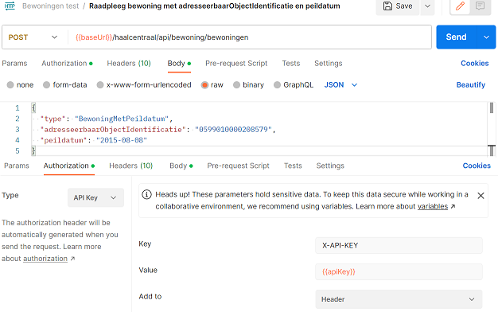
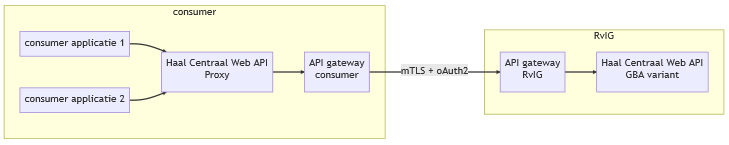
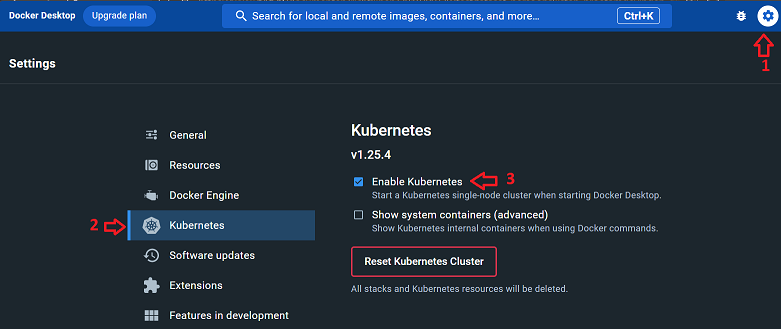

# Getting Started

De '{{ site.apiname }}' Web API biedt functionaliteit om de bewoning van een adresseerbaar object te bevragen.

1. Bekijk de [API specificatie en functionele documentatie](#api-specificatie-en-functionele-documentatie)
2. Probeer de API in de [proef omgeving](#probeer-de-api-in-de-proef-omgeving)
3. Probeer de Proxy [lokaal](#probeer-de-proxy-lokaal-met-docker-desktop) met Docker Desktop
4. Probeer de Proxy [lokaal](#probeer-de-proxy-lokaal-met-kubernetes) met Kubernetes
5. Routeer Proxy aanroepen naar de [GBA variant van de '{{ site.apiname }}' in de proef omgeving](#routeer-proxy-aanroepen-naar-de-gba-variant-van-de-web-api-in-de-proef-omgeving)
6. [Download]({{ site.onboardingUrl }}){:target="_blank" rel="noopener"} en lees het onboardingproces

## API specificatie en functionele documentatie

De '{{ site.apiname }}' Web API is gespecificeerd met behulp van de [OpenAPI Specification v3.0.3](https://spec.openapis.org/oas/v3.0.3){:target="_blank" rel="noopener"}.

Je kunt de OAS3 specificatie van de '{{ site.apiname }}' Web API bekijken met behulp van [Redoc](./redoc).

De [functionele documentatie](./features-overzicht) van de '{{ site.apiname }}' Web API vind je in de [features overzicht](./features-overzicht).

## Probeer de API in de demo omgeving

Je kunt de '{{ site.apiname }}' Web API uitproberen in de demo omgeving. Bevraag de API op het volgende endpoint: [{{ site.proefProxyUrl }}/haalcentraal/api/bewoning/bewoningen]({{ site.proefProxyUrl }}/haalcentraal/api/bewoning/bewoningen). Hiervoor heb je een apikey nodig.

De demo omgeving ontsluit de bewoning van adresseerbaar objecten die voorkomen in de [Testdataset Basisregistratie Personen](https://www.rvig.nl/Testdataset-persoonslijsten-proefomgevingen-GBA-V.ods){:target="_blank" rel="noopener"}

Vraag een apikey aan bij de [product owner](mailto:{{ site.PO-email }}) of gebruik de apikey die is uitgereikt op de API Labs.

Met behulp van het volgende curl statement wordt op basis van een adresseerbaar object identificatie en peildatum de bewoning van het adresseerbaar object op de peildatum opgehaald:

```sh

curl --request POST \
--url 'https://proefomgeving.haalcentraal.nl/haalcentraal/api/bewoning/bewoningen' \
--header 'Content-Type: application/json' \
--header 'X-API-KEY: <<APIKEY>>' \
--data '{
  "type": "BewoningMetPeildatum",
  "adresseerbaarObjectIdentificatie": "0599010000208579",
  "peildatum": "2015-08-08"
}'

```

Onderstaand figuur visualiseert de configuratie van bovenstaande aanroep in Postman.

**Opmerking**. In de demo omgeving kan alleen de bewoning van adresseerbaar objecten in de gemeente Rotterdam worden geraadpleegd.



## Probeer de Proxy lokaal met Docker Desktop

Door wettelijke restricties kan de '{{ site.apiname }}' Web API bepaalde bewerkingen niet uitvoeren. Er wordt op dit moment gewerkt aan het Experimentbesluit Dataminimalisatie om deze restricties weg te halen. Totdat het experimentbesluit van kracht is moet de '{{ site.apiname }}' Proxy worden gebruikt om de bewerkte gegevens te kunnen krijgen.

De '{{ site.apiname }}' Proxy is een containerized applicatie die in de omgeving van een consumer moet worden gehost. Bevragingen van de '{{ site.apiname }}' Web API moet naar de '{{ site.apiname }}' Proxy worden gestuurd, zodat deze de bevragingen kan routeren naar de GBA variant van de '{{ site.apiname }}' Web API. Responses van deze Web API worden getransformeerd naar responses conform de {{ site.apiname }} [OAS3 specificatie]({{ site.v2SpecUrl }}){:target="_blank" rel="noopener"} voordat deze naar de bevrager worden gestuurd.

Onderstaand figuur is een globale illustratie van de communicatie tussen een consumer applicatie en een BRP Web API.



De '{{ site.apiname }}' Proxy kan lokaal worden uitgeprobeerd met behulp van [Docker Desktop](https://www.docker.com/products/docker-desktop){:target="_blank" rel="noopener"}. Hiervoor moet:

- [Docker Desktop](https://www.docker.com/products/docker-desktop){:target="_blank" rel="noopener"} op een Windows of Mac PC worden geïnstalleerd
- op dezelfde Windows of Mac PC het [docker compose bestand]({{ site.v2DockerComposeUrl }}){:target="_blank" rel="noopener"} worden gedownload

Start een command prompt in de map met het gedownloade [docker compose bestand]({{ site.v2DockerComposeUrl }}){:target="_blank" rel="noopener"} en voer het volgende statement uit om de '{{ site.apiname }}' Proxy op te starten:

```sh

docker-compose up -d

```

Behalve de '{{ site.apiname }}' Proxy wordt lokaal ook een mock van de GBA variant van de '{{ site.apiname }}' Web API opgestart. De mock maakt het mogelijk om lokaal zonder apikey de functionaliteit van de '{{ site.apiname }}' Web API uit te proberen.

Met behulp van het volgende curl statement wordt op basis van een adresseerbaar object identificatie en peildatum de bewoning van het adresseerbaar object op de peildatum via de '{{ site.apiname }}' Proxy bij de mock opgehaald:

```sh

curl --request POST \
--url 'http://localhost:5003/haalcentraal/api/bewoning/bewoningen' \
--header 'Content-Type: application/json' \
--data '{
  "type": "BewoningMetPeildatum",
  "adresseerbaarObjectIdentificatie": "0599010000208579",
  "peildatum": "2015-08-08"
}'

```

Om de Proxy en de mock containers te stoppen moet de volgende statement worden uitgevoerd:

```sh

docker-compose down

```

## Probeer de Proxy lokaal met Kubernetes

De '{{ site.apiname }}' Proxy kan lokaal ook worden uitgeprobeerd met behulp van Kubernetes. Hiervoor moet:

- [Docker Desktop](https://www.docker.com/products/docker-desktop){:target="_blank" rel="noopener"} op een Windows of Mac PC worden geïnstalleerd
- in Docker Desktop de Kubernetes ondersteuning worden aangezet in de Settings/Kubernetes configuratie scherm 
- op dezelfde Windows of Mac PC de [Kubernetes manifest bestanden]({{ site.mainBranchUrl }}/.k8s){:target="_blank" rel="noopener"} worden gedownload

Start een command prompt in de map met de gedownloade [Kubernetes manifest bestanden]{{ site.mainBranchUrl }}/.k8s){:target="_blank" rel="noopener"} en voer het volgende statement uit om de '{{ site.apiname }}' Proxy op te starten:

```sh

kubectl apply -f .k8s/proxy-deployment.yaml \
              -f .k8s/proxy-service.yaml \
              -f .k8s/mock-deployment.yaml \
              -f .k8s/mock-service.yaml 

```

Behalve de '{{ site.apiname }}' Proxy wordt lokaal ook een mock van de GBA variant van de '{{ site.apiname }}' Web API opgestart. De mock maakt het mogelijk om lokaal zonder apikey de functionaliteit van de '{{ site.apiname }}' Web API uit te proberen.

Met behulp van het volgende curl statement wordt op basis van een adresseerbaar object identificatie en peildatum de bewoning van het adresseerbaar object op de peildatum via de '{{ site.apiname }}' Proxy bij de mock opgehaald:

```sh

curl --request POST \
--url 'http://localhost:5003/haalcentraal/api/bewoning/bewoningen' \
--header 'Content-Type: application/json' \
--data '{
  "type": "BewoningMetPeildatum",
  "adresseerbaarObjectIdentificatie": "0599010000208579",
  "peildatum": "2015-08-08"
}'

```

Om de Proxy en de mock containers te stoppen moet het volgende statement worden uitgevoerd:

```sh

kubectl delete -f .k8s/proxy-deployment.yaml \
                -f .k8s/proxy-service.yaml \
                -f .k8s/mock-deployment.yaml \
                -f .k8s/mock-service.yaml 

```

## Routeer Proxy aanroepen naar de GBA variant van de Web API in de proef omgeving

Hiervoor moeten environment variabelen worden toegevoegd aan de '{{ site.apiname }}' Proxy in het [docker compose bestand]({{ site.v2DockerComposeUrl }}){:target="_blank" rel="noopener"}.

Stop eerst de proxy container met behulp van het volgende statement:

```sh

docker-compose down

```

Voeg de volgende environment variabelen toe aan de configuratie van de '{{ site.apiname }}' Proxy in het [docker compose bestand]({{ site.v2DockerComposeUrl }}){:target="_blank" rel="noopener"}:

- Routes__0__DownstreamScheme. Het communicatieprotocol dat moet worden gebruikt voor het aanroepen van de {{ site.apiname }} Web API GBA variant
- Routes__0__DownstreamHostAndPorts__0__Host. De host naam van de aan te roepen {{ site.apiname }} Web API GBA variant
- Routes__0__DownstreamHostAndPorts__0__Port. Het port nummer van de aan te roepen  {{ site.apiname }} Web API GBA variant

De configuratie van de '{{ site.apiname }}' Proxy ziet in het [docker compose bestand]({{ site.v2DockerComposeUrl }}){:target="_blank" rel="noopener"} er dan als volgt uit:

```yaml

  bewoningproxy:
    container_name: bewoningproxy
    image: ghcr.io/brp-api/haal-centraal-bewoning-bevragen-proxy:latest
    build:
      context: .
      dockerfile: src/BewoningProxy/Dockerfile
    environment:
      - ASPNETCORE_ENVIRONMENT=Release
      - ASPNETCORE_URLS=http://+:5000
      - Routes__0__DownstreamScheme=https
      - Routes__0__DownstreamHostAndPorts__0__Host=proefomgeving-gba.haalcentraal.nl
      - Routes__0__DownstreamHostAndPorts__0__Port=443
    ports:
      - "5003:5000"
    networks:
      - bewoningen-api-network

```

Start de '{{ site.apiname }}' Proxy met behulp van het volgende statement:

```sh

docker-compose up -d

```

Met behulp van het volgende curl statement wordt op basis van een adresseerbaar object identificatie en peildatum de bewoning van het adresseerbaar object op peildatum via de '{{ site.apiname }}' Proxy bij de GBA variant van de '{{ site.apiname }}' Web API in de proef omgeving opgehaald:

```sh

curl --request POST \
--url 'http://localhost:5003/haalcentraal/api/bewoning/bewoningen' \
--header 'Content-Type: application/json' \
--header 'X-API-KEY: <<APIKEY>>' \
--data '{
  "type": "BewoningMetPeildatum",
  "adresseerbaarObjectIdentificatie": "0599010000208579",
  "peildatum": "2015-08-08"
}'

```

Raadpleeg de [Proxy configuratie](./proxy-configuratie) documentatie voor een overzicht van de configuratie settings.
